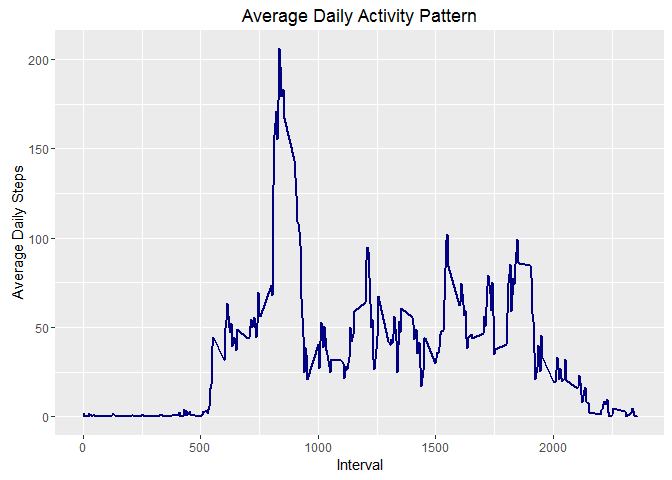
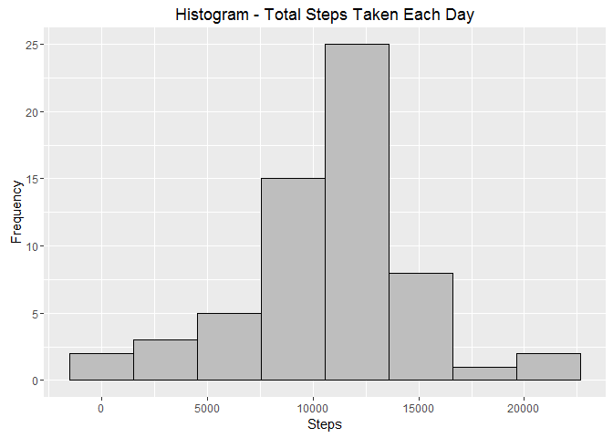
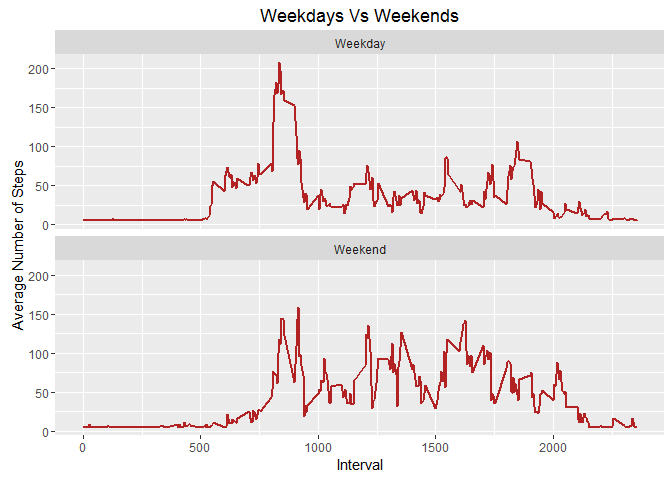

# Reproducible Research: Peer Assessment 1
### Yanal Kashou

## Prepare R

***
## Loading and preprocessing the data


```r
# Download and unzip dataset
url <- "https://d396qusza40orc.cloudfront.net/repdata%2Fdata%2Factivity.zip"
f <- file.path(getwd(), "activity_dataset.zip")
download.file(url, f)

if(!file.exists("activity.csv")) {
        unzip(f)
}

# Load libraries
library(ggplot2)

# Import dataset
import <- read.csv("activity.csv", header = TRUE, sep = ",")

# Explore
head(import) 	# Reveals dataset is in the form (steps, date, interval)
```

```
##   steps       date interval
## 1    NA 2012-10-01        0
## 2    NA 2012-10-01        5
## 3    NA 2012-10-01       10
## 4    NA 2012-10-01       15
## 5    NA 2012-10-01       20
## 6    NA 2012-10-01       25
```

```r
str(import) 	# Reveals dataset is 3 Columns and 17568 Rows
```

```
## 'data.frame':	17568 obs. of  3 variables:
##  $ steps   : int  NA NA NA NA NA NA NA NA NA NA ...
##  $ date    : Factor w/ 61 levels "2012-10-01","2012-10-02",..: 1 1 1 1 1 1 1 1 1 1 ...
##  $ interval: int  0 5 10 15 20 25 30 35 40 45 ...
```
***
## What is mean total number of steps taken per day?


```r
# Calculate the steps taken each day
steps_each_day <- tapply(import$steps, as.factor(import$date),sum)

# Plot a histogram showing the steps taken each day
qplot(steps_each_day,
	geom = "histogram",
	main = "Histogram - Total Steps Taken Each Day",
	xlab = "Steps",
	ylab = "Frequency",
	bins = 8,
	fill = I("grey"),
	col = I("black"))
```

```
## Warning: Removed 8 rows containing non-finite values (stat_bin).
```


```r
# Calculate the mean number of steps taken each day
mean(steps_each_day, na.rm = TRUE)
```

```
## [1] 10766.19
```

```r
# Calculate the median number of steps taken each day
median(steps_each_day, na.rm = TRUE)
```

```
## [1] 10765
```
**The mean number of steps taken each day is 10766.19 compared to the median which is 10765.**  
***
## What is the average daily activity pattern?


```r
#Aggregate to average the number of steps across all days
interval_steps <- aggregate(steps ~ interval, import, mean)

# Time-Series Plot
tplot <- ggplot(interval_steps, (aes(x = interval_steps$interval, y = interval_steps$steps))) + geom_line(size=1, colour = "#000080") +
xlab("Interval") + ylab("Average Daily Steps") +
ggtitle("Average Daily Activity Pattern")
tplot
```



```r
# Maximum number of steps on average
max.steps <- which.max(interval_steps$steps)
max.steps
```

```
## [1] 104
```

```r
# Interval at which occurs maximum number of steps on average
interval.max.steps <- interval_steps[max.steps, ]
interval.max.steps
```

```
##     interval    steps
## 104      835 206.1698
```
**The maximum number of steps is 206 and occurs at interval 834.**  

***
## Imputing missing values


```r
# We know from the nature of the data that only the 'steps' column contains missing values.
# We can easily use the sum function to find the value of NAs
# as when "is.na = TRUE", it returns a value of 1, and if is.na = FALSE, returns a value of 0.
# Then the sum will be the number of NAs.
# And thus giving us the number of rows where they occur out of 17568
missing <- sum(is.na(import$steps))
missing
```

```
## [1] 2304
```

```r
# One possible strategy is to use the mean value instead of the NA values.
avg_steps <- mean(interval_steps$steps)

# Duplicate dataset 
import_imputed <- import

# Replace NAs with Average
import_imputed$steps[is.na(import_imputed$steps)] <- avg_steps

# 'import' dataset should be intact
head(import)
```

```
##   steps       date interval
## 1    NA 2012-10-01        0
## 2    NA 2012-10-01        5
## 3    NA 2012-10-01       10
## 4    NA 2012-10-01       15
## 5    NA 2012-10-01       20
## 6    NA 2012-10-01       25
```

```r
# 'import_imputed' dataset should have NAs set = 37.3826 (avg_steps)
head(import_imputed)
```

```
##     steps       date interval
## 1 37.3826 2012-10-01        0
## 2 37.3826 2012-10-01        5
## 3 37.3826 2012-10-01       10
## 4 37.3826 2012-10-01       15
## 5 37.3826 2012-10-01       20
## 6 37.3826 2012-10-01       25
```

```r
# Calculate the steps taken each day
imputed.steps_each_day <- tapply(import_imputed$steps, as.factor(import_imputed$date),sum)
```

```r
# Calculate the imputed number of steps taken each day
mean(imputed.steps_each_day)
```

```
## [1] 10766.19
```

```r
# Calculate the imputed median number of steps taken each day
median(imputed.steps_each_day)  
```

```
## [1] 10766.19
```
**After imputing the missing values, both the mean and median number of steps taken each day are now 10766.19.**  


```r
# Plot a histogram showing the steps taken each day
qplot(imputed.steps_each_day,
	geom = "histogram",
	main = "Histogram - Total Steps Taken Each Day",
	xlab = "Steps",
	ylab = "Frequency",
	bins = 8,
	fill = I("grey"),
	col = I("black"))
```




**After imputing the NAs from the dataset 'import' and using the modified dataset 'import_imputed', we find that the values do differ, and in fact there is a significant rise in the peak values of the histogram, however it does not have an effect on the shape of the histogram.**  
***
## Are there differences in activity patterns between weekdays and weekends?


```r
# Convert date column to date class
import_imputed$date <- as.Date(import_imputed$date)
# Add the day of the week column
import_imputed$weekday = weekdays(import_imputed$date)
# Add the weekday or weekend column
import_imputed$weekday.type <- ifelse(import_imputed$weekday == "Saturday" | import_imputed$weekday == "Sunday", "Weekend", "Weekday")
# Convert the column to factor
import_imputed$weekday.type <- factor(import_imputed$weekday.type)
# Display the dataset now
head(import_imputed)
```

```
##     steps       date interval weekday weekday.type
## 1 37.3826 2012-10-01        0  Monday      Weekday
## 2 37.3826 2012-10-01        5  Monday      Weekday
## 3 37.3826 2012-10-01       10  Monday      Weekday
## 4 37.3826 2012-10-01       15  Monday      Weekday
## 5 37.3826 2012-10-01       20  Monday      Weekday
## 6 37.3826 2012-10-01       25  Monday      Weekday
```

```r
#Aggregate to average the number of steps across all days for the imputed dataset
imputed.interval_steps <- aggregate(steps ~ interval + weekday.type, import_imputed, mean)

# Plot the time series Weekdays Vs Weekends
t2plot <- ggplot(imputed.interval_steps, 
	aes(x = imputed.interval_steps$interval, y = imputed.interval_steps$steps)) + 
	geom_line(size=0.8, colour = "#b22222") +
	xlab("Interval") +
	ylab("Average Number of Steps") +
	ggtitle("Weekdays Vs Weekends") +
  	facet_wrap(~ weekday.type, ncol = 1)
t2plot
```



**We can safely deduce that on weekends people tend to be active at later hours. And there is also a decrease from the number of people active in the morning.**
***
